# 秦EV300尊荣的1700公里充电测试

## 3月10日

### 19:21

磨蹭到下班时间才出发，车外温度平均14，时速定在118，从帝都出来跳过保定到望都服务区充电站，剩余续航51公里，跟预想一样只有我一辆孤零零地在这里充电，这里的桩电流不到50A，预计充满要1.5小时，跟预期差距有点大，先吃东西去了……

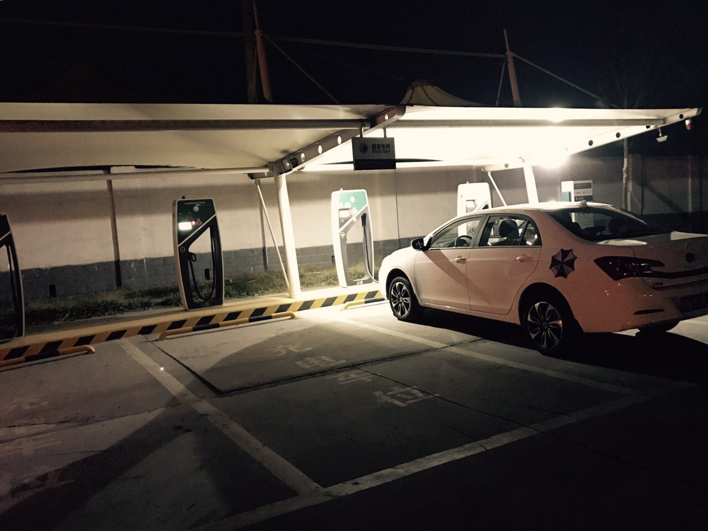
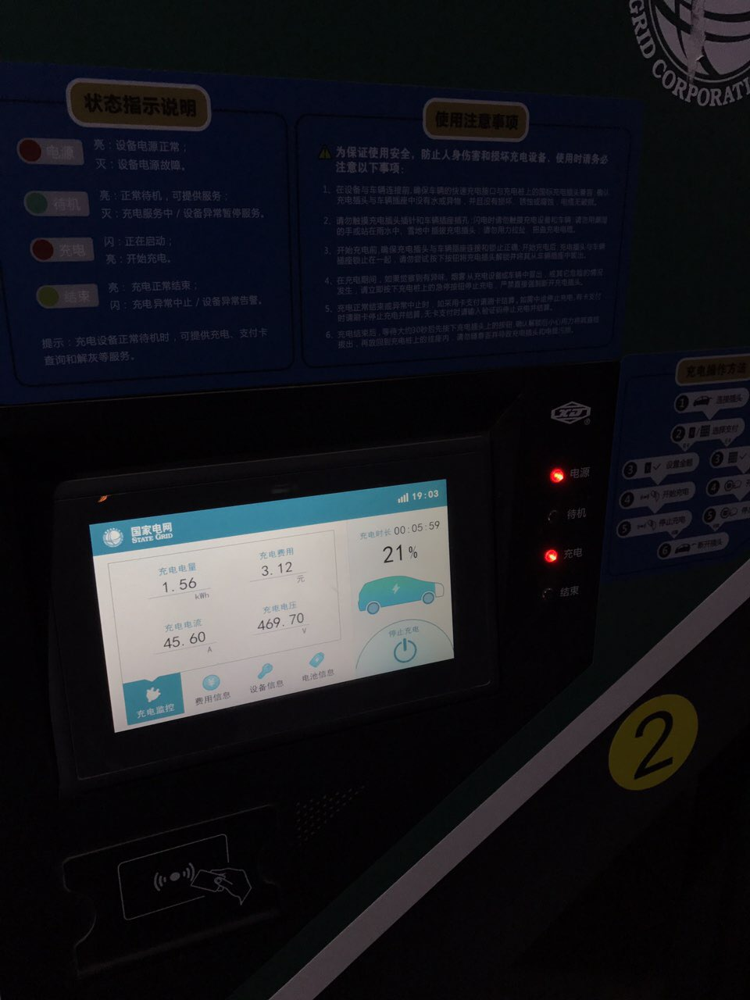

### 21:38

受不了“快充”拔枪赶往几十公里后的藁城北，这里不是许继集团的桩了，是鲁能产的，功率达到30kw，好多了，ps服务区洗手间现在都是热水了啊～ 大晚上有热水用好幸福

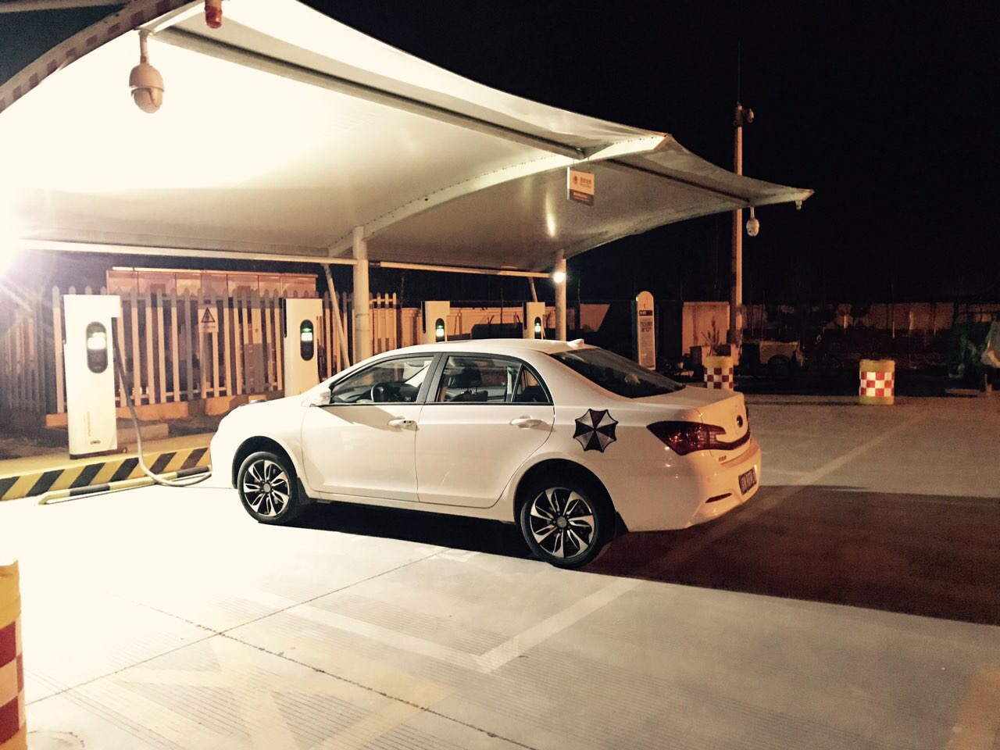
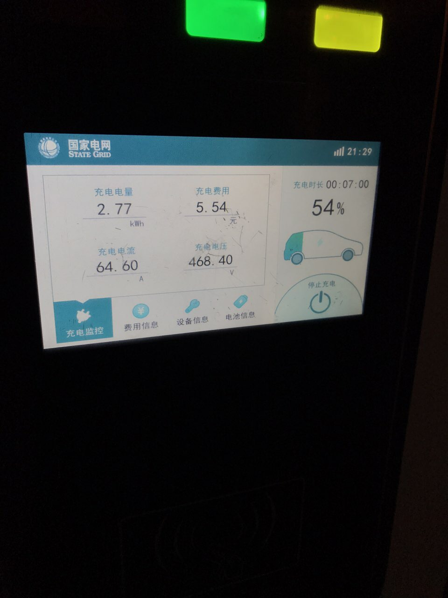

### 23:58

车外温度9，以防意外提早下了服务区，这里仍是许继产的桩，但功率也到了30kw（传说80-120kw那种我怎么碰不到），ps终于谷底电价了，趁机小睡了

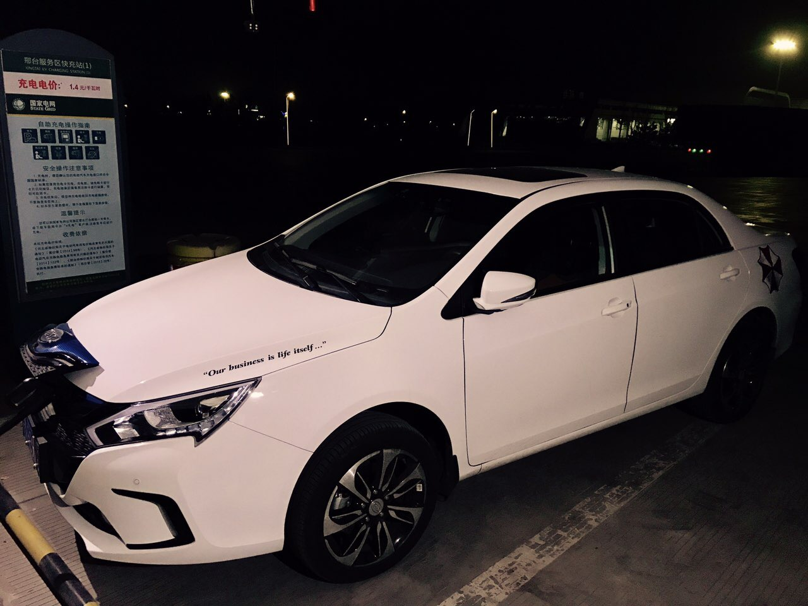

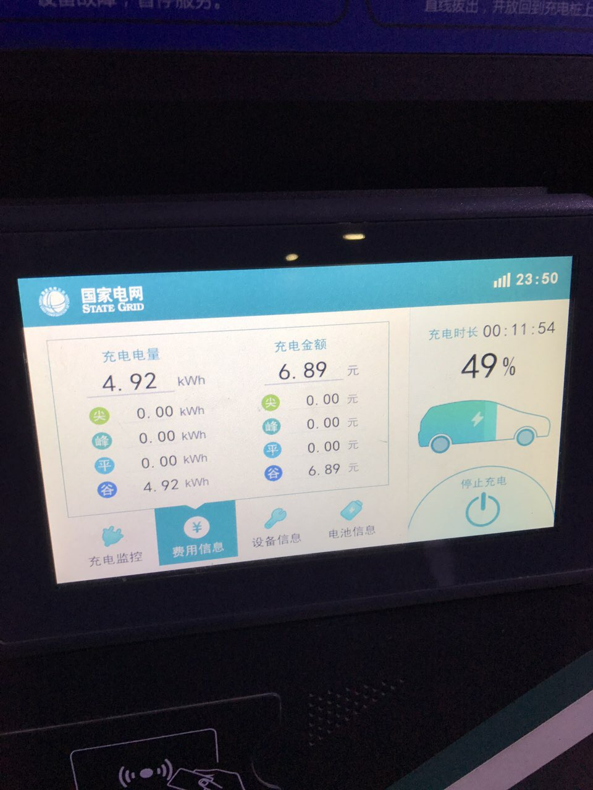

## 3月11日

### 07:13

睡过了，这是最重要的一站必须充满了再走，因为马上要离开G4了，剩下的100多公里省道是没有充电站的。

1. 途中为了赶时间定速巡航在118，但定速在98的能耗要低40%，但慢着溜不符合我的风格……
2. 河南的电价比河北便宜3倍，应该是每度4毛左右
3. 全程开着座椅加热、暖风无AC、蓝牙听歌，总之没刻意关设备（有人甚至关ESP就为了增加那点续航）

更具体的参考和建议，待行程结束再发总结～

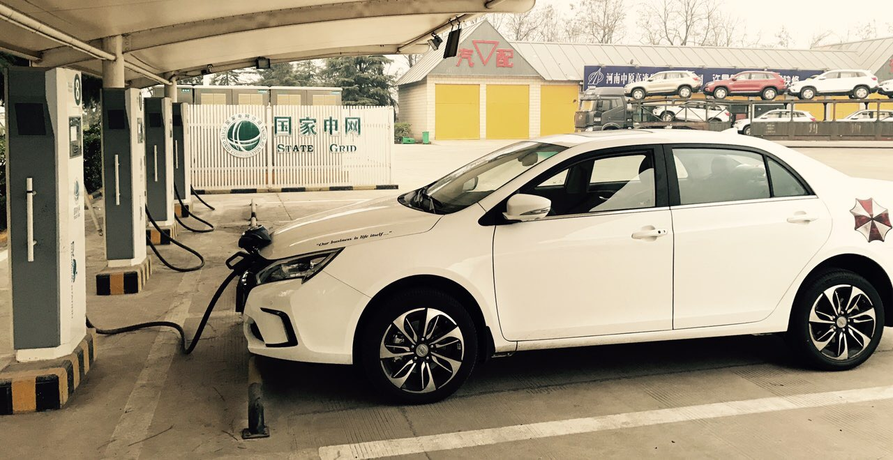
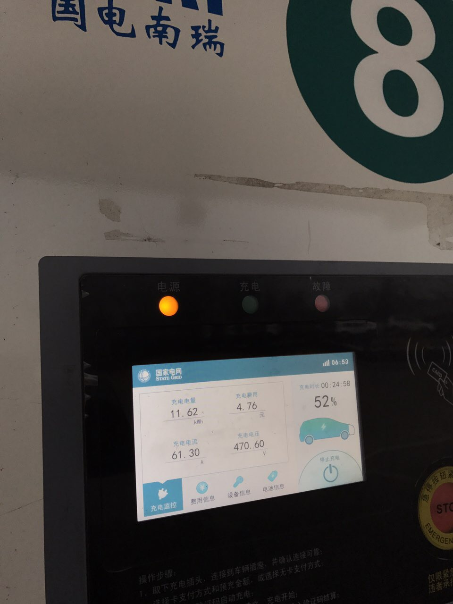

## 3月12日

### 11:42

昨天850公里的路实际走了14小时（以往油车10小时）多的时间就是试桩和充电了（所有桩只能到30kw应该是车上周的1次升级限制了低温的充电功率），充电花费213元

准备回程了，有经验后节省找桩时间、放弃95%后低功率涓流过程应该能更快。

另外在家乡也有充电桩了，图1国网的需要一对一的慢充枪（我忘了买……），然后是找到一个处单位自用的图2这种巨大的快充桩（很多台），以后再也不用发愁找桩了

最后图3让大家感受下基建狂魔的力量，每个数字表示的是充电站的数量，每个充电站有4-几百台桩不等，然后这里显示的只是国家电网的桩，在私营企业的app里可以看到相似的运营桩密度而且不重合

今年新车的主流续航是400公里，但未来趋势并不是堆容量，而是快充速度！（充电5分钟续航500公里）

就目前来讲眼下出远门也不是问题，你把它当做一次长途旅行而不是赶路，带本书、看看路人风景、寻找在路上那种孤独感，会得到许多不一样的感受～

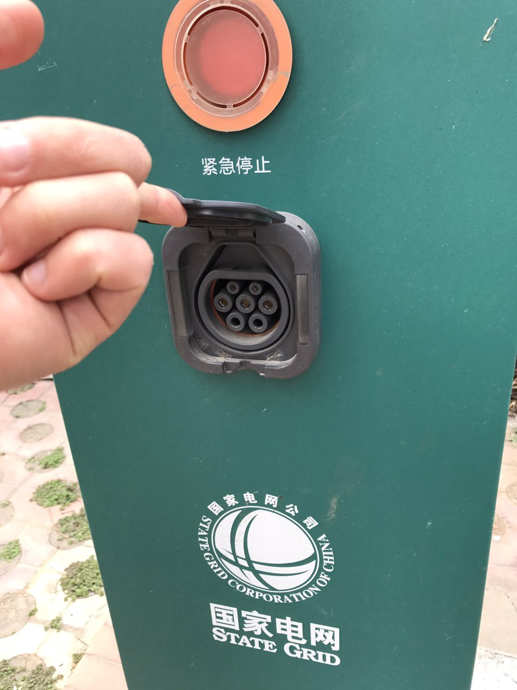
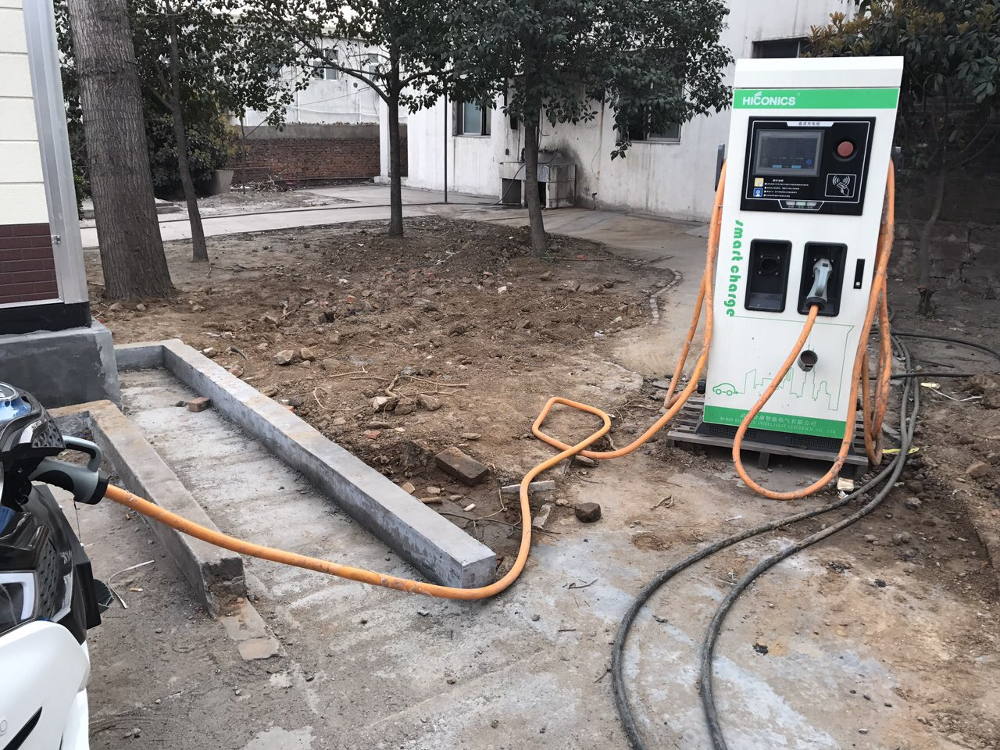
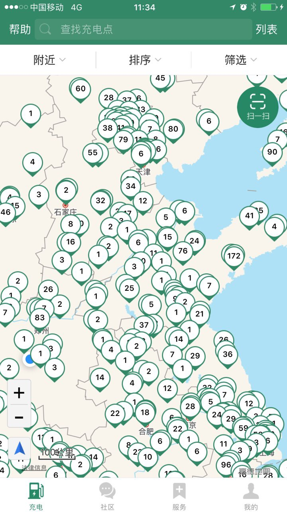

## 3月13日

### 09:38

可能是线贵的缘故，沿途大多是这种短线，很好奇那种充电口在侧面的车好好停的前提下能够着么……

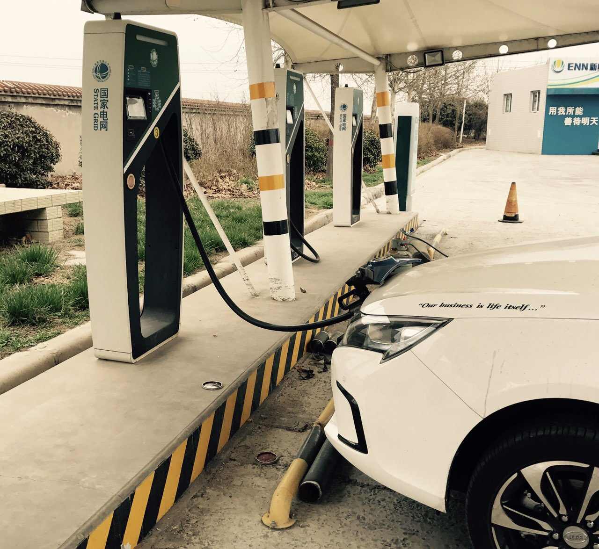

### 16:52

回程出发晚了3小时以及遇到两次低功率的服务区，还是回来晚了。放弃涓流过程还是有效的，节省约1.5小时，当然白天气温回升也很重要。 电费约200。图中已经是充得最快的一次了

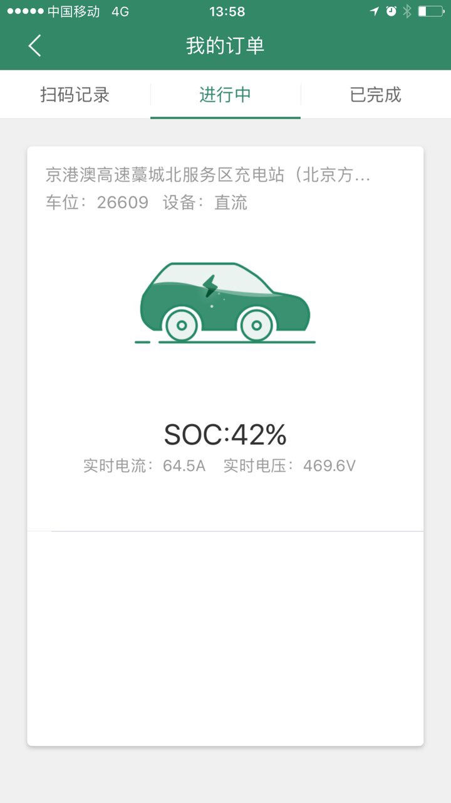
